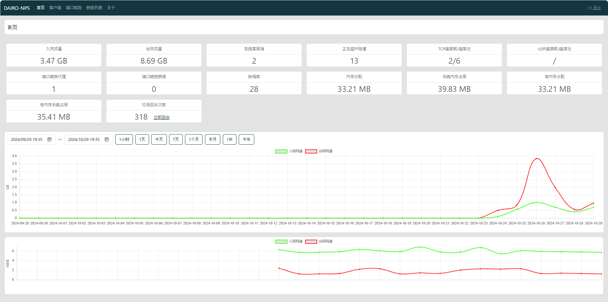

# DairoNPS
nps是一款轻量级、高性能、功能强大的**内网穿透**代理服务器。目前支持**tcp、udp流量转发**，可支持任何**tcp、udp**上层协议（访问内网网站、本地支付接口调试、ssh访问、远程桌面，内网dns解析等等……），此外还**支持内网http代理、内网socks5代理**、**p2p等**，并带有功能强大的web管理端。


## 背景

1. 做微信公众号开发、小程序开发等----> 域名代理模式

2. 想在外网通过ssh连接内网的机器，做云服务器到内网服务器端口的映射，----> tcp代理模式

3. 在非内网环境下使用内网dns，或者需要通过udp访问内网机器等----> udp代理模式

4. 在外网使用HTTP代理访问内网站点----> tcp代理模式

5. 搭建一个内网穿透ss，在外网如同使用内网vpn一样访问内网资源或者设备----> socks5代理模式
## 特点
- 协议支持全面，兼容几乎所有常用协议，例如tcp、udp、http(s)、socks5、p2p、http代理...
- 全平台兼容(linux、windows、macos等)，支持一键安装为系统服务
- 控制全面，同时支持服务端和客户端控制
- 操作简单，只需简单的配置即可在web ui上完成其余操作
- 展示信息全面，流量、系统信息、即时带宽、客户端版本等

## 快速开始

### 安装
> [releases](https://github.com/DAIRO-HY/DairoNPS/releases)

下载对应的系统版本即可，服务端和客户端是单独的

### 服务端启动
下载完服务器压缩包后，解压，然后进入解压后的文件夹

- 执行安装命令

Linux | Mac OS
```bash
curl -L -o dairo-nps-linux-amd64 https://github.com/DAIRO-HY/DairoNPS/releases/download/1.0.5/dairo-nps-linux-amd64
chmod +x dairo-nps-linux-amd64
./dairo-nps-linux-amd64
```

Windows
> 点击[dairo-nps-win-amd64.exe](https://github.com/DAIRO-HY/DairoNPS/releases/download/1.0.5/dairo-nps-win-amd64.exe)下载程序包，双击即可运行。

对于windows，管理员身份运行cmd，进入安装目录 ```nps.exe install```

- 默认端口

DairoNPS默认配置文件使用了1780，1781，1782端口

1780为web管理访问端口

1781和1782分别为客户端的TCP和UDP端口


**如果发现没有启动成功，可以查看日志(日志文件存在当前程序目录下的./data/log/日期.log)**
- 访问服务端ip:web服务端口（默认为1780）。例：http://192.168.1.100:1780
- 使用用户名和密码登陆（用户名默认admin，密码启动时在控制台会打印出密码）
- 创建客户端

### 客户端安装请参考以下连接
- 客户端[DairoNPC](https://github.com/DAIRO-HY/DairoNPC)。

### 配置
- 客户端连接后，在web中配置对应穿透服务即可